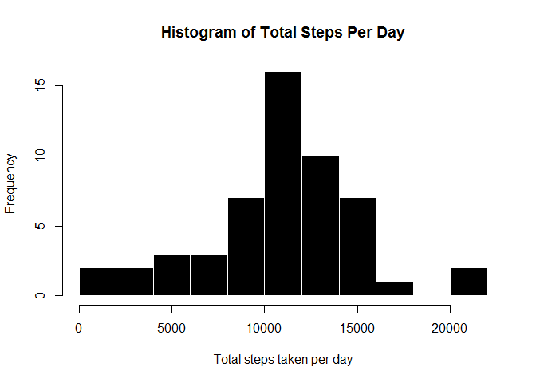
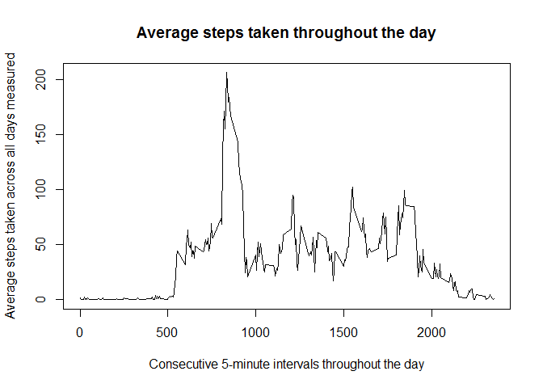
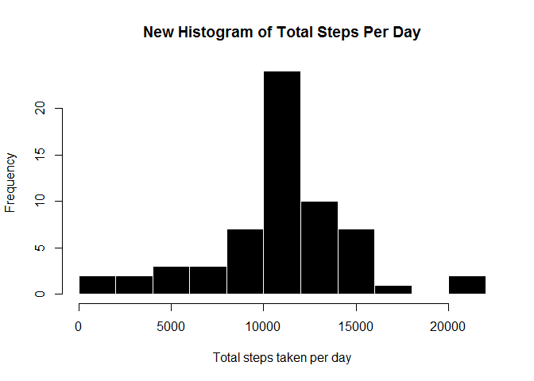
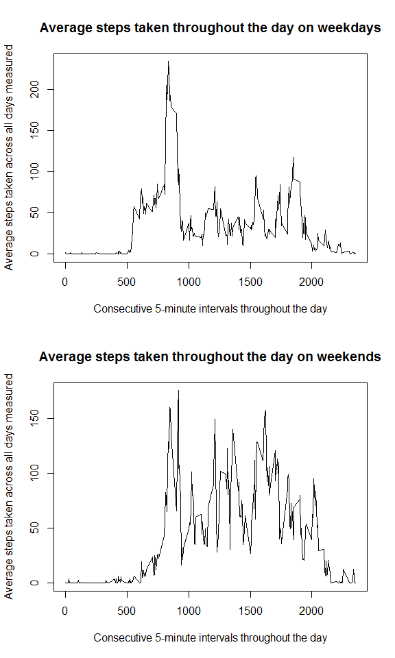

# Reproducible Research: Peer Assessment 1


## Loading and preprocessing the data


```r
# Loads the data into R.
activity <- read.csv("activity.csv")
```


## What is mean total number of steps taken per day?


```r
# Aggregates steps by date.
aggregated.date <- aggregate(steps ~ date, data = activity,
                             FUN = function(x) c(sum = sum(x)))


# Shows the results.
hist(aggregated.date$steps, 
     main = "Histogram of Total Steps Per Day",
     xlab = "Total steps taken per day",
     col = "black",
     border = "white",
     breaks = 10)
```

 

```r
# Computes mean and median steps taken per day.
mean.per.day <- mean(aggregated.date$steps)
median.per.day <- median(aggregated.date$steps)
```

The mean number of steps taken per day is 10766.19 steps and the median number of steps taken per day is 10765 steps.

## What is the average daily activity pattern?


```r
# Aggregates mean steps by interval.
aggregated.interval <- aggregate(steps ~ interval, data = activity,
                                 FUN = function(x) c(mean = mean(x)))

# Shows the results.
plot(steps ~ interval, data = aggregated.interval, type = "l",
     main = "Average steps taken throughout the day",
     xlab = "Consecutive 5-minute intervals throughout the day",
     ylab = "Average steps taken across all days measured",
     col = "black")
```

 

```r
# Finds the interval with the maximum number of average steps.
most.active.interval <- aggregated.interval$interval[which(aggregated.interval$steps == max(aggregated.interval$steps))]
```

On average, the maximum number of steps taken occurs during the 5-minute interval starting at the 835th minute of the day.


## Imputing missing values


```r
# Computes the total number of incomplete cases in the dataset.
dim(activity[!complete.cases(activity),])[1]
```

```
## [1] 2304
```

```r
# Copies dataset before modifying.
copie.activity <- activity

# Fills in empty step data with mean for a given interval.
for (row in which(is.na(copie.activity$steps))) {
    copie.activity$steps[row] <- as.numeric(aggregated.interval[aggregated.interval$interval == copie.activity$interval[row],]["steps"])
}

# Aggregates steps by date.
aggregated.copie.date <- aggregate(steps ~ date, 
                                      data = copie.activity, 
                                      FUN = function(x) c(sum = sum(x)))

# Shows the results.
hist(aggregated.copie.date$steps, 
     main = "New Histogram of Total Steps Per Day",
     xlab = "Total steps taken per day",
     col = "black",
     border = "white",
     breaks = 10)
```

 

```r
# Computes mean and median steps taken per day.
mean.per.day <- mean(aggregated.copie.date$steps)
median.per.day <- median(aggregated.copie.date$steps)
```

The mean number of steps taken per day with our dataset (the backup dataset, in wich replacing NA's with the mean number of steps for the given time interval) is 10766.19 steps.

The median number of steps taken per day is 10766.19 steps. 

Thus, after making this modification to our original dataset (filling in empty data), we found that the mean number of steps taken per day remained the same while the median shifted to match the mean. This ultimately creates less variance in the resulting distribution (compare histograms).


## Are there differences in activity patterns between weekdays and weekends?


```r
# Function to determine if a given weekday name is on the weekend or not.
weekday.type <- function(day.of.week) {
    if (day.of.week == "Saturday" || day.of.week == "Sunday") {
        return("weekend")
    } else {
        return("weekday")
    }
}

# Determine which days are weekend days.
day.factor <- sapply(weekdays(as.Date(activity$date)), FUN = weekday.type)

# Add new variable to dataset.
activity$day <- factor(day.factor)

# Aggregates mean steps by interval for weekdays.
aggregated.interval.weekday <- aggregate(steps ~ interval, data = activity[activity$day == "weekday",], FUN = function(x) c(mean = mean(x)))

# Aggregates mean steps by interval for weekends.
aggregated.interval.weekend <- aggregate(steps ~ interval, data = activity[activity$day == "weekend",], FUN = function(x) c(mean = mean(x)))
```

```r
# Changes plotting parameters.
par(mfrow = c(2, 1))

# Shows the results.
plot(steps ~ interval, data = aggregated.interval.weekday, type = "l",
     main = "Average steps taken throughout the day on weekdays",
     xlab = "Consecutive 5-minute intervals throughout the day",
     ylab = "Average steps taken across all days measured",
     col = "black")

plot(steps ~ interval, data = aggregated.interval.weekend, type = "l",
     main = "Average steps taken throughout the day on weekends",
     xlab = "Consecutive 5-minute intervals throughout the day",
     ylab = "Average steps taken across all days measured",
     col = "black")
```

 

As we can see, stepping activity is much more uniformly distributed throughout the day on weekends. 
This is likely because commuters walk a lot to get to work and then sit at a desk for most of the day on weekdays, but on weekends they tend to be active all throughout the day.
